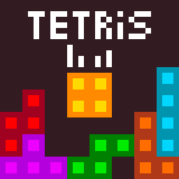

<p align="center"></p>

# Tetris
Данное приложение является игрой на pygame, всецело повторяющей гемплей тетриса. Было создано двумя людьми в качестве второго проекта по Яндекс.Лицею, что значит, что данная игра изнчально не предназначена для выпуска на рынок, или выкладывания на какие-либо тематические сайты.

# Инструкция по использованию

- Скачайте последний релиз приложения

- Распакуйте полученный архив и запустите `main.exe`

# Инструкция по запуску исходного кода

 - Клонировать репозиторий

	```shell
	git clone https://github.com/Nytrock/LyceumPygameProject.git
	```

 - Установить зависимости с помощью requirements.txt
	```shell
	pip install -r requirements.txt
	```
 
 - Открыть и запустить файл `main.py`
 
 - Не пропускайте сразу главное меню игры, ведь там написано всё управление
